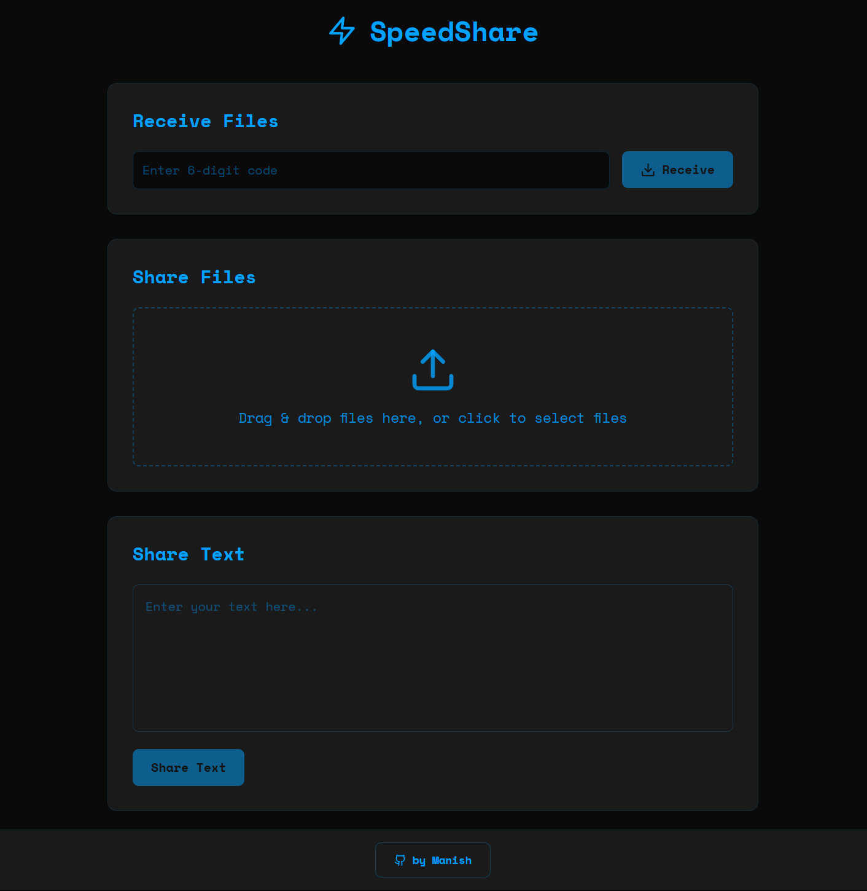

# SpeedShare

**SpeedShare** is a web application designed to make file and text/code snippet sharing simple and efficient. With SpeedShare, you can upload files (images, videos, documents, music, APKs, software, etc.) (up to 50 MB) or share snippets seamlessly using unique codes.

---

## 📌 Features

### 🔗 File Sharing  
- Upload any file type (e.g., images, videos, documents).  
- A unique **6-digit code** is generated for each file upload.  
- Share the code with others to enable easy downloading.  

### 📝 Text/Code Sharing  
- Input text or code snippets directly in the app.  
- Receive a **unique code** to share with your recipient.  
- Enables instant collaboration or sharing of small data chunks.  

---

## 🚀 How to Use

### 📤 Share Files
1. Drag and drop files into the upload section or click to select files.  
2. A unique **6-digit code** will be generated.  
3. Share this code with the recipient for downloading the file.  

### 📥 Receive Files
1. Enter the **6-digit code** in the "Receive File" section.  
2. Click the **"Receive"** button to download the file.  

### 📝 Share Text/Code
1. Input text or paste code snippets in the designated area.  
2. Click **"Share Text"** to generate a unique code.  
3. Share this code to give access to the text/code snippet.  

---

## 🌟 Screenshot  
<!--
  
-->

**Click the images to view the project in action!*

## 🔗 Live Project

Check out SpeedShare: [SpeedShare](https://speedshare.vercel.app)

---

## 🛠 Built With  

| Technology              | Purpose                                              |
|-------------------------|------------------------------------------------------|
| **TypeScript (ts)**     | Ensures type safety and robustness in the codebase   |
| **CSS**                 | Styles the user interface for a polished look        |
| **React (tsx)**         | Builds dynamic and interactive components            |
| **JavaScript (js)**     | Adds functionality and interactivity to the app      |
| **HTML**                | Structures the application's web pages               |
| **Supabase**            | Provides backend as a service with real-time databases|

---

## 🤝 Contributing  

We welcome contributions!  
- **Report Issues**: Found a bug? Open an issue on GitHub.  
- **Suggest Features**: Propose enhancements or new ideas.  
- **Submit Pull Requests**: Collaborate by improving the codebase.

---
